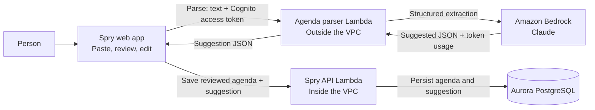

# Agenda parser container view (C4 level 2)

```mermaid
flowchart LR
  user["Person"] --> browser["Spry web app\nPaste, review, edit"]
  browser -->|"Parse: text + Cognito access token"| parser["Agenda parser Lambda\nOutside the VPC"]
  parser -->|"Structured extraction"| bedrock["Amazon Bedrock\nClaude"]
  bedrock -->|"Suggested JSON + token usage"| parser
  parser -->|"Suggestion JSON"| browser
  browser -->|"Save reviewed agenda + suggestion"| api["Spry API Lambda\nInside the VPC"]
  api -->|"Persist agenda and suggestion"| db[("Aurora PostgreSQL")]
```

Parsing is isolated from writes. The parser does not connect to Aurora; the normal API validates and persists the reviewed result.
